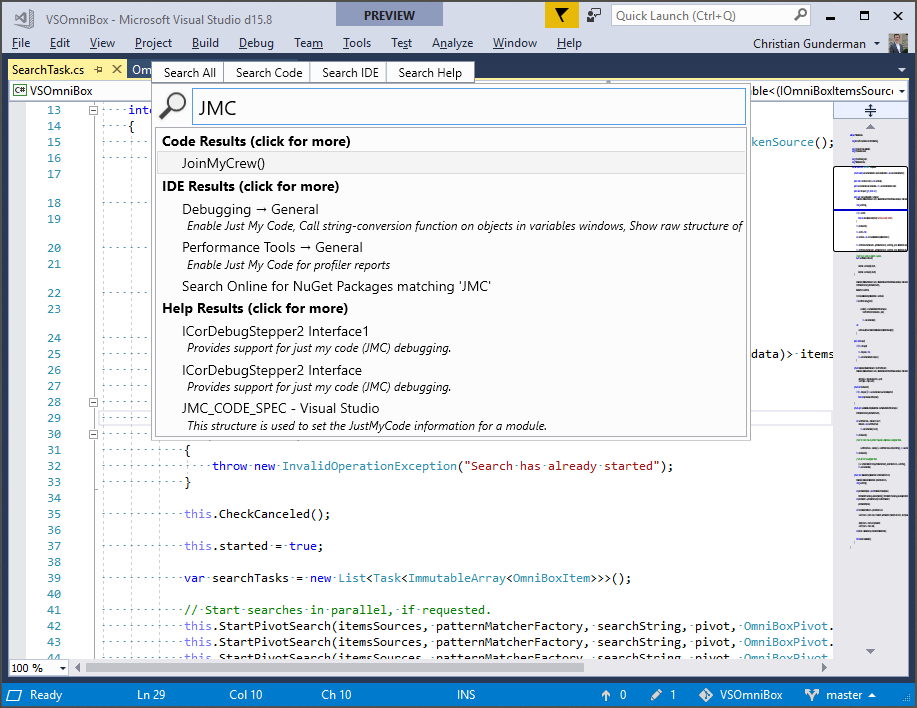

# Visual Studio OmniSearch Concept
*A single unified search box for navigation and invocation of VS features*

## Introduction

Visual Studio has 16 distinct search boxes, each of which has varying levels of search accuracy, and a limited breadth.
This project is a crude proof of concept of an all encompassing search box that is intended to demonstrate how a single
box could conceivably act as a code search, discoverability mechanism, and user education tool.

## Features
- Code Search (encompasses all of NavigateTo/GoTo)
- Menu/Options/Installer/Nuget search (encompasses all of Quick Launch)
- Template search (encompasses all of New Project Dialog search)
- Docs search (searches docs.microsoft.com)

## 'Nice to haves' to complete the concept
- Item template search (searches 'Add Item' dialog)
- Installed extensions search
- Display options as checkboxes inline
- Display theme as inline drop down
- Cortana style 'IDE cards' (displays quick actions such as errors, test failures, etc. based on IDE state).
- Gallery search (could be ported from: https://github.com/gundermanc/VSPackageInstaller)

## State of the Project

This project is 'demoable' and 'usable' but is not 'dependable'. I'm looking for additional contributors to help me bring up the quality and breadth.

## Building

This project has no special build magic. Simply clone the repo, build, and run with Visual Studio 2017 15.7 or later.

